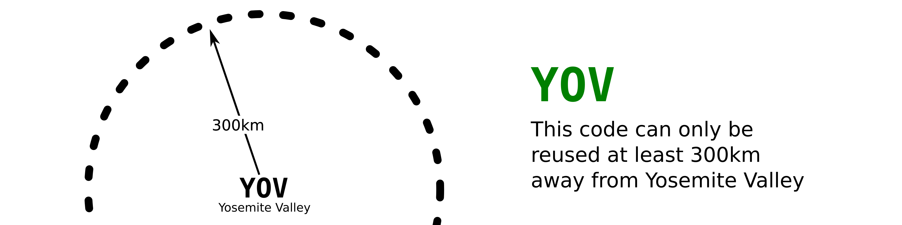
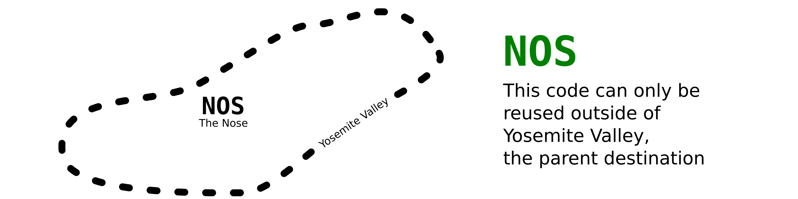

# Consensus Climb & Area Codes

- Climbing is growing quickly and guides are fragmenting.
- A climb identification scheme would help maintain cohesion.
- Climbers would be able to better use multiple guides or platforms
- New guides and younger platforms would see improved discoverability.

For brevity, this refers to
<em><strong>Co</strong>nsensus <strong>C</strong>limb and <strong>A</strong>rea Codes</em>
as
_Coca Codes_.
The name _Coca Code_ isn't final and this document is a draft.

## Overview

Essentially, Coca Codes are common abbreviations for climbs and climbing destinations.

There are three major guidelines:

1. A code should be concise.
2. A code should resemble the name.
3. A code must be unique within its context
   - within a geographic radius, a code must be unique
   - within a destination, climbs codes should be unique

These guidelines help meet a few broader goals:

- Offer concise, transparent identification for climbs and destinations
- Be easily adoptable (e.g., simple, approachable, low-code)
- Be useful in multiple contexts
  - readable and writable by computers and humans
  - usable in printed guidebooks and digital guides
- Allow the community to find consensus when codes differ
  
### Destination Codes: Unique Within 300km



Destination Codes must be unique within ~200 miles (300 kilometers).
This is sufficiently accurate for casual conversation.
When prefixed with a 3-character geohash it will be globally unique.

<table>
  <thead>
    <tr>
      <th>Destination</th>
      <th>Code</th>
      <th>Near</th>
      <th>Plain Text</th>
    </tr>
  </thead>
  <tbody>
    <tr>
      <td>Yosemite Valley</td>
      <td>YOV</td>
      <td><a href="https://geohash.softeng.co/9qd">9qd</a></td>
      <td class="codes-table__code">9qd:YOV</td>
    </tr>
    <tr>
      <td>Tuolumne Meadows</td>
      <td>TUO</td>
      <td><a href="https://geohash.softeng.co/9qe">9qe</a></td>
      <td class="codes-table__code">9qe:TUO</td>
    </tr>
    <tr>
      <td>Red Rocks</td>
      <td>RED</td>
      <td><a href="https://geohash.softeng.co/9qm">9qm</a></td>
      <td class="codes-table__code">9qm:RED</td>
    </tr>
    <tr>
      <td>Fontainbleau</td>
      <td>FONT</td>
      <td><a href="https://geohash.softeng.co/u09">u09</a></td>
      <td class="codes-table__code">u09:FONT</td>
    </tr>
    <tr>
      <td>The Gunks</td>
      <td>GNX</td>
      <td><a href="https://geohash.softeng.co/dr7">dr7</a></td>
      <td class="codes-table__code">dr7:GNX</td>
    </tr>
    <tr>
      <td>The New River Gorge</td>
      <td>NRG</td>
      <td><a href="https://geohash.softeng.co/dny">dny</a></td>
      <td class="codes-table__code">dny:NRG</td>
    </tr>
  </tbody>
</table>

The term <em>destination</em> here is used for the idea of
a geospatial boundary that organizes climbs.
Destinations do not intersect or nest.
This is in contrast with an <em>area</em> which, as generally used,
is too vague to be practical for our purposes.

<details>
  <summary>Area/Destination Differences</summary>
  <p>
    Take the The Red River Gorge: from North to South it&apos;s about
    <a href="https://www.redriverclimbing.com/RRCGuide/?type=map">20 miles</a>,
    and it contains smaller regions,
    sometimes sub-divided by ownership,
    which contain crags,
    these can be organized by walls,
    and sometimes divided further into sections of walls. 
  </p>

  </p>
    The Red River Gorge is an extreme example that
    highlights the mess around what's considered an area.
    For our purposes, we need a simple solution to identify climbs;
    adding <em>areas</em> could get out of hand quickly.
  </p>
</details>

### Climb Codes: Unique Within 5km


Climb Codes should be unique within 3 miles (5km).
This sufficiently precise for casual conversation or use within a guidebook.
Also, when prefixed with a 6-character geohash, it will be globally unique.

<table>
  <thead>
    <tr>
      <th>Climb</th>
      <th>Code</th>
      <th>Near/In</th>
      <th>Plain Text</th>
    </tr>
  </thead>
  <tbody>
    <tr>
      <td>Plumber&apos;s Crack</td>
      <td>PLC</td>
      <td><a href="https://geohash.softeng.co/9qmvtw">9qmvtw</a></td>
      <td>9qmvtw:PLC</td>
    </tr>
    <tr>
      <td>Midnight Lightning</td>
      <td>MNL</td>
      <td><a href="https://geohash.softeng.co/9qdywq">9qdywq</a></td>
      <td>9qdywq:MNL</td>
    </tr>
    <tr>
      <td>The Nose</td>
      <td>NOS</td>
      <td><a href="https://geohash.softeng.co/9qdyts">9qdyts</a></td>
      <td>9qdyts:NOS</td>
    </tr>
  </tbody>
</table>

### Climb Codes: Unique Within Destination



Climb Codes must also be unique within their destination.
 
Optionally, for improved human friendliness,
the parent destination&apos;s code can be used.

<table>
  <thead>
    <tr>
      <th>Climb</th>
      <th>Code</th>
      <th>Within</th>
      <th>Plain Text</th>
    </tr>
  </thead>
  <tbody>
    <tr>
      <td>Plumber&apos;s Crack</td>
      <td><a href="https://geohash.softeng.co/9qm">9qm</a></td>
      <td>RED</td>
      <td>9qm:RED:PLC</td>
    </tr>
    <tr>
      <td>Midnight Lightning</td>
      <td><a href="https://geohash.softeng.co/9qd">9qd</a></td>
      <td>YOV</td>
      <td class="codes-table__code">9qd:YOV:MNL</td>
    </tr>
    <tr>
      <td>The Nose</td>
      <td><a href="https://geohash.softeng.co/9qd">9qd</a></td>
      <td>YOV</td>
      <td class="codes-table__code">9qd:YOV:NOS</td>
    </tr>
  </tbody>
</table>

This allows users and authors be concise and brief when there's a common context,
like a guidebook.

Also, see
[interactive examples](https://stele-climbing.gitlab.io/climb-and-area-codes/examples/).

## For climbers

**TODO**

<!--
  this will be a short section about how to take advantage of the codes;
  climbers in general will only be treating them as a tool.
-->

## For climbing developers

Assuming you have a climb (or destination) and you want a code for it:

1. check a Coca explorer (and guidebooks) to see if a code already exists
2. pick a code
   <!-- abstract ids or non-literal names prevent renaming issues -->
3. upload to services or contact guidebook authors

**TODO:** make a simple flow chart for this

## For guidebook authors and platforms

**TODO:** add hints and guidelines for services that want to support Coca codes

Simplicity is the goal.
A <a href="https://en.wikipedia.org/wiki/Tab-separated_values" title="text/tab-separated-values">TSV</a>
documents would be easy to create, share, and use.
Generating a TSV is trivial with Excel or any programming language.


### Store Coca Codes and Coordinates

**TODO:** explain that most simply, these are two text fields

### Publish Coca Codes

Climbs and Destinations should be listed
in a `coca-codes.tsv` file with five fields:

- **Type** this should be either `c` for climb or `d` for destination
- **Geohash**
- **Coca Code**
- **Name**
- **Location**

```tsv
c	9qdyts	NOS	The Nose	https://www.example.com/climbs/the-nose/
d	9qd	YOV	Yosemite Valley	https://www.example.com/areas/yosemite-valley/
```

## Existing solutions outside of climbing

This the prior art relation to climb identification,
globally/universally unique ids,
and geospatial identification.

### Big Random(ish) Values

- [UUID](https://datatracker.ietf.org/doc/html/rfc4122)
- [ULID](https://github.com/ulid/spec)
- [ObjectId](https://www.mongodb.com/docs/manual/reference/method/ObjectId/) from MongoDB
- Youtube ID
  ([nice overview on capacity](https://www.youtube.com/watch?v=gocwRvLhDf8))
  
<!-- https://sudhir.io/uuids-ulids -->


### Geospatial

- [geohash](http://geohash.org/)
  - [OSM's Wiki](https://wiki.openstreetmap.org/wiki/Geohash)
  - [An explorer](https://www.movable-type.co.uk/scripts/geohash.html)
  - [Another nice explorer](https://geohash.softeng.co/)
  - []()
- [what3words](https://what3words.com/)
  is interesting, but not immediately applicable to our needs
- [Mapcode](https://www.mapcode.com/)
  offers a system that's analagous to ours in a few ways,
  but is primarily a geocoding system.
  The [Territories](https://www.mapcode.com/territory) page, however,
  is particularly relevant.
- [plus codes](https://maps.google.com/pluscodes/)

The article [Geocode](https://en.wikipedia.org/wiki/Geocode)
offers many other options


### Other

- Books use the
  [Dewey Decimal Classification](https://en.wikipedia.org/wiki/Dewey_Decimal_Classification)
  and
  [ISBN](https://en.wikipedia.org/wiki/International_Standard_Book_Number)
- Chemicals have a
  [CAS RN](https://en.wikipedia.org/wiki/CAS_Registry_Number)
- Countries use 
  [ISO 3166](https://en.wikipedia.org/wiki/ISO_3166)
  and
  [ISO 3166-2](https://en.wikipedia.org/wiki/ISO_3166-2)

### questions, issues, and comments

#### a code for every climb on earth?

The scheme should be able to handle a code for every destination and climb in the world.
In practice that won't happen.

#### what about climb variations?

Climb variations exist on a spectrum.

- In the most clear-cut case,
  variations are based on natural lines and simply describe where to start/stop or which features to follow.
  - The Gradpa Peabody hosts two well known examples
    - Rastaman Vibration (V12) and its sit start, Lucid Dreaming (V15)
    - The charitably named Evilution to the Lip (V10) stops early and Evilution (V12-13 R) continues the line to the top of the boulder
  - **TODO:** add an example for route/bigwall
- Other variations link up sections of other climbs
  - The british route Rainman (9b) wanders to seek out cruxes of established routes
    "Starts up Raindogs 8a,
     negotiates the crux of Rainshadow 9a,
     then leads up Batman 9a/+ before finishing up Bat Route 8c and also incorporates some new ground."
  - **TODO:** pick a well-known example of a direct line that "links" two climbs that evade the difficult terrain
- Some of the most contrived variations are eliminates.
  - These crop up in high-traffic areas where demand for climbs outweighs the available rock.
    - "climb the face, without using the arete"
    - "Dyno variation XYZ skips the intermediates and from the jug, goes straight to the lip"
  - In some cases these variations are widely published. Usually they're local trends

All of these are well-handled by codes.
When names differ, it's a cut-and-dred solution. 
More subtle variations can be handled by appending a L, C, R (left center right) to the common name, 
or numbering them with RK1, RK2, RK3.

#### How are conflicts handled?

- A climb or destination occurs on a geohash "boundary"
  - Alabama Hills, in CA is divided between `9qe` and `9qs`
  - Estes Park, in CO is close to both `9xh` and `9xj`
- Two near(ish) destinations have been assigned the same code
  - the explorer helps
  - climbs being independent means they don't inherit issues from destinations 
- Two providers have assigned a climb different codes
  - the explorer helps

#### What about (auto)generated codes?

Generating codes for suggestion to a human editor could be useful,
though that algorithm would need to be quite good.
For a climber, picking and typing a few letters is about as difficult as evaluating and confirming a computer-generated code.
If the generated code is poor, the manual process will be necessary anyway.
Also, the codes are meant to be human-friendly, which is is hard to quantify (though, hard to fail entirely):
a human-chosen code would probably be more friendly that a computer generated code.

Autopopulating codes for a database is infeasible.
It would be unlikely to advance the goals of Coca Codes,
and if implemented, would probably damage the public opinion of this or future climb-id systems.

The "Co" in Coca comes from COnsensus.
For the various platforms to auto-generate codes that concur with one another, may things would need to be true:

1. All platforms must have decent gps coordinates for destinations and climbs.
2. All platforms must use an identical algorithm.
3. When platforms share a climb or destination, they must be named identically.
4. Platforms must have knowledge of the climbs that they're lacking.
   - an imaginary crag, "The Birds", has four climbs "Look Up", "Crows Fly", "Crowds Flee", and "Directed by Hitchcock"
   - The local community uses PlatformB and it has all four climbs well-documented.
   - A visiting climber who uses PlatformF enjoyed "Look Up" and "Crowds Flee".
   - They wanted to log their ticks, so they uploaded the two climbs.
   - "The Universal Algorithm" uses the first three letters as when there are no conflicts.
   - PlatformB, autopopulates the climbs as `LOO`, `CRO`, `CRF`, and `DBH`
   - Climbing PlatformF, must know about both "Crows Fly" and "Crowds Flee" or it would assign `LOO`, _none_, `CRO`, and _none_.

If the requirements of autopopulation were met, a climb-id scheme would pointless.

#### What is a valid code?

- is there an upper limit on characters?
- is there a  lower limit on characters?
  - see [Go!](https://www.mountainproject.com/route/106004766/go)
    and [Go](https://www.mountainproject.com/route/113230570/go)
- Ascii only? `/[A-Z0-9]/` only? Is Unicode okay?
  - see [Mañana](https://www.mountainproject.com/route/105835105/manana)

#### what is a good code?

- Should letters to reflect spelling or phoenetics?
  `GUNKS` vs `GUNK` vs `GNK` vs `GNX`?

#### precision & keyspace

- **TODO:** Test some destinations that are densly populated with climbs
- **TODO:** Test some states/regions that are densly populated with destinations
- Is a 3-character geohash precise enough for destinations?
- Is a 6-character geohash precise enough for climbs?
- Is a 3-character code precise enough for destinations?
- Is a 3-character code precise enough for climbs?
  - `Math.pow('abcdefghijklmnopqrstuvwxyz0123456789'.length, 4) == 1679616`
  - `Math.pow('abcdefghijklmnopqrstuvwxyz0123456789'.length, 3) == 46656`
  - JTree has &gt;20,000 routes
    (see <a href="https://www.youtube.com/watch?v=HQUwdfuEkKk">this</a>)

#### code & geohash similarities

Geohashes can look like words
(e.g., [`dry`](https://geohash.softeng.co/dry),
       [`spy`](https://geohash.softeng.co/spy), and
       [`ben`](https://geohash.softeng.co/ben)).
Could this be an issue?

#### what is a destination?

- is it Yosemite National Park, Yosemite Valley, Upper Yosemite Valley, El Capitain
- How much does it matter? What are the consequences?

#### why is `:` used?

The separator between codes, `:`, wasn't an intentional choice.
A [url-friendly](https://stackoverflow.com/questions/695438/what-are-the-safe-characters-for-making-urls)
separator could be better because this is intended for apps.
For now, this issue can kicked down the road beacuse nothing depends on using `:`.

Revisiting this before any sort of release will be a good idea.
