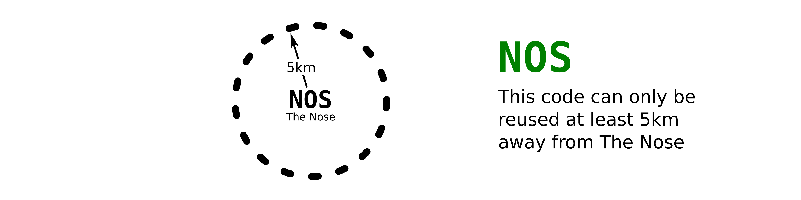

# Consensus Climb & Area Codes

- Climbing is growing quickly and guides are fragmenting.
  ation scheme would help climbers
  use multiple guides/platforms and it would encourage platform discovery.
- The id scheme should be accurate enough to be helpful,
  but not so precise that it becomes cumbersome.
- For brevity, this refers to
  _<strong>Co</strong>nsensus <strong>C</strong>limb and <strong>A</strong>rea Codes_
  as
  _Coca Codes_.
- The name _Coca Code_ isn't final and this document is a draft.

## Overview

Essentially, Coca Codes are common abbreviations for climbs and climbing destinations.

These codes should meet a few goals:

1. Offer concise, transparent identification for climbs and destinations
2. Be easily adoptable (e.g., simple, approachable, low-code)
3. Be useful in multiple contexts
   - readable and writable by computers and humans
   - usable in printed guidebooks and digital guides
4. Allow the community to come to a consensus
   when codes differ
  
### Destination Codes
  


Destination Codes must be unique within ~200 miles (300 kilometers).
This is sufficiently accurate for casual conversation.
When prefixed with a 3-character geohash it will be globally unique.

<table>
  <thead>
    <tr>
      <th>Destination</th>
      <th>Code</th>
      <th>Near</th>
      <th>Plain Text</th>
    </tr>
  </thead>
  <tbody>
    <tr>
      <td>Yosemite Valley</td>
      <td>YOV</td>
      <td><a href="https://geohash.softeng.co/9qd">9qd</a></td>
      <td class="codes-table__code">9qd:YOV</td>
    </tr>
    <tr>
      <td>Tuolumne Meadows</td>
      <td>TUO</td>
      <td><a href="https://geohash.softeng.co/9qe">9qe</a></td>
      <td class="codes-table__code">9qe:TUO</td>
    </tr>
    <tr>
      <td>Red Rocks</td>
      <td>RED</td>
      <td><a href="https://geohash.softeng.co/9qm">9qm</a></td>
      <td class="codes-table__code">9qm:RED</td>
    </tr>
    <tr>
      <td>Fontainbleau</td>
      <td>FONT</td>
      <td><a href="https://geohash.softeng.co/u09">u09</a></td>
      <td class="codes-table__code">u09:FONT</td>
    </tr>
    <tr>
      <td>The Gunks</td>
      <td>GNX</td>
      <td><a href="https://geohash.softeng.co/dr7">dr7</a></td>
      <td class="codes-table__code">dr7:GNX</td>
    </tr>
    <tr>
      <td>The New River Gorge</td>
      <td>NRG</td>
      <td><a href="https://geohash.softeng.co/dny">dny</a></td>
      <td class="codes-table__code">dny:NRG</td>
    </tr>
  </tbody>
</table>


The term <em>destination</em> here is used for the idea of
a geospatial boundary that organizes climbs.
Destinations do not intersect or nest.
This is in contrast with an <em>area</em> which, as generally used,
is too vague to be practical for our purposes.

<details>
  <summary>Area/Destination Differences</summary>
  <p>
    Take the The Red River Gorge: from North to South it&apos;s about
    <a href="https://www.redriverclimbing.com/RRCGuide/?type=map">20 miles</a>,
    and it contains smaller regions,
    sometimes sub-divided by ownership,
    which contain crags,
    these can be organized by walls,
    and sometimes divided further into sections of walls. 
  </p>
  
  </p>
    The Red River Gorge is an extreme example that
    highlights the mess around what's considered an area.
    For our purposes, we need a simple solution to identify climbs;
    adding <em>areas</em> could get out of hand quickly.
  </p>
</details>

### Climb Codes


  
Climb Codes should be unique within either 3 miles (5km)
_or_ the destination that the climb is in,
whichever contains more climbs.
This sufficiently precise for casual conversation or use within a guidebook.
Also, when prefixed with a 6-character geohash, it will be globally unique.

Optionally, for improved human friendliness,
the parent destination&apos;s code can be used.

<table>
  <thead>
    <tr>
      <th>Climb</th>
      <th>Code</th>
      <th colspan=2>Near/In</th>
      <th>Plain Text</th>
    </tr>
  </thead>
  <tbody>
    <tr>
      <td rowspan=2>Plumber&apos;s Crack</td>
      <td rowspan=2>PLC</td>
      <td colspan=2><a href="https://geohash.softeng.co/9qmvtw">9qmvtw</a></td>
      <td class="codes-table__code">9qmvtw:PLC</td>
    </tr>
    <tr>
      <td><a href="https://geohash.softeng.co/9qm">9qm</a></td>
      <td>RED</td>
      <td class="codes-table__code">9qm:RED:PLC</td>
    </tr>
    <tr>
      <td rowspan=2>Midnight Lightning</td>
      <td rowspan=2>MNL</td>
      <td colspan=2><a href="https://geohash.softeng.co/9qdywq">9qdywq</a></td>
      <td class="codes-table__code">9qdywq:MNL</td>
    </tr>
    <tr>
      <td><a href="https://geohash.softeng.co/9qd">9qd</a></td>
      <td>YOV</td>
      <td class="codes-table__code">9qd:YOV:MNL</td>
    </tr>
    <tr>
      <td rowspan=2>The Nose</td>
      <td rowspan=2>NOS</td>
      <td colspan=2><a href="https://geohash.softeng.co/9qdyts">9qdyts</a></td>
      <td class="codes-table__code">9qdyts:NOS</td>
    </tr>
    <tr>
      <td><a href="https://geohash.softeng.co/9qd">9qd</a></td>
      <td>YOV</td>
      <td class="codes-table__code">9qd:YOV:NOS</td>
    </tr>
  </tbody>
</table>

Also, see
[interactive examples](https://stele-climbing.gitlab.io/climb-and-area-codes/examples/).

## For climbers

**TODO**

<!--
  this will be a short section about how to take advantage of the codes;
  climbers in general will only be treating them as a tool.
-->

## For climbing developers

Assuming you have a climb (or destination) and you want a code for it:

1. check a Coca explorer (and guidebooks) to see if a code already exists
2. pick a code
   <!-- abstract ids or non-literal names prevent renaming issues -->
3. upload to services or contact guidebook authors

**TODO:** make a simple flow chart for this

## For guidebook authors and platforms

**TODO:** add hints and guidelines for services that want to support Coca codes

Simplicity is the goal.
A <a href="https://en.wikipedia.org/wiki/Tab-separated_values" title="text/tab-separated-values">TSV</a>
documents would be easy to create, share, and use.
Generating a TSV is trivial with Excel or any programming language.


### Store Coca Codes and Coordinates

**TODO:** explain that most simply, these are two text fields

### Publish Coca Codes

Climbs and Destinations should be listed
in a `coca-codes.tsv` file with five fields:

- **Type** this should be either `c` for climb or `d` for destination
- **Geohash**
- **Coca Code**
- **Name**
- **Location**

```tsv
c	9qdyts	NOS	The Nose	https://www.example.com/climbs/the-nose/
d	9qd	YOV	Yosemite Valley	https://www.example.com/areas/yosemite-valley/
```

## Existing solutions outside of climbing

This the prior art relation to climb identification,
globally/universally unique ids,
and geospatial identification.

### Big Random(ish) Values

- [UUIDs](https://datatracker.ietf.org/doc/html/rfc4122)
- [ULID](https://github.com/ulid/spec)
- [ObjectId](https://www.mongodb.com/docs/manual/reference/method/ObjectId/) from MongoDB
- Youtube ID
  ([nice overview on capacity](https://www.youtube.com/watch?v=gocwRvLhDf8))
- []()
- []()
  
<!-- https://sudhir.io/uuids-ulids -->

### Geospatial

- [geohash](http://geohash.org/)
  - [OSM's Wiki](https://wiki.openstreetmap.org/wiki/Geohash)
  - [An explorer](https://www.movable-type.co.uk/scripts/geohash.html)
  - [Another nice explorer](https://geohash.softeng.co/)
  - []()
- [what3words](https://what3words.com/)
  is interesting, but not immediately applicable to our needs
- [Mapcode](https://www.mapcode.com/)
  offers a system that's analagous to ours in a few ways,
  but is primarily a geocoding system.
  The [Territories](https://www.mapcode.com/territory) page, however,
  is particularly relevant.
- [plus codes](https://maps.google.com/pluscodes/)

The article [Geocode](https://en.wikipedia.org/wiki/Geocode)
offers many other options

### Other

- Books use the
  [Dewey Decimal Classification](https://en.wikipedia.org/wiki/Dewey_Decimal_Classification)
  and
  [ISBN](https://en.wikipedia.org/wiki/International_Standard_Book_Number)
- Chemicals have a
  [CAS RN](https://en.wikipedia.org/wiki/CAS_Registry_Number)
- Countries use 
  [ISO 3166](https://en.wikipedia.org/wiki/ISO_3166)
  and
  [ISO 3166-2](https://en.wikipedia.org/wiki/ISO_3166-2)


## Questions, Issues, and Comments
- The codes should be durable;
  The scheme should be able to handle close-calls.
  - Alabama Hills, in CA is divided between `9qe` and `9qs`
  - Estes Park, in CO is close to both `9xh` and `9xj`
- Geohashes can look like words.
  ([`dry`](https://geohash.softeng.co/dry),
   [`spy`](https://geohash.softeng.co/spy), and
   [`ben`](https://geohash.softeng.co/ben))
  Could this be an issue?
    
- What is a destination?
  (e.g., Yosemite National Park, Yosemite Valley, Upper Yosemite Valley, El Capitain)
  - Does it really matter?
  - What are the consequences?
  - Do destination-prefixed climbs cause an issue here?
- guidelines & suggestions    
  - is there an upper limit on characters?
    Can I use 4 letters for a destination?
    5 letters?
  - is there a  lower limit on characters?
    - see [Go!](https://www.mountainproject.com/route/106004766/go)
      and [Go](https://www.mountainproject.com/route/113230570/go)
  - Ascii only? Is Unicode okay?
    - see [Mañana](https://www.mountainproject.com/route/105835105/manana)
  - Pick letters to reflect spelling or phoenetics?
    GUNKS vs GUNK vs GNK vs GNX?
- precision & keyspace
  - Test some destinations that are densly populated with climbs
  - Test some states/regions that are densly populated with destinations
  - Is a 3-character geohash precise enough for destinations?
  - Is a 6-character geohash precise enough for climbs?
  - Is a 3-character code precise enough for destinations?
  - Is a 3-character code precise enough for climbs?
    - `Math.pow('abcdefghijklmnopqrstuvwxyz0123456789'.length, 4) == 1679616`
    - `Math.pow('abcdefghijklmnopqrstuvwxyz0123456789'.length, 3) == 46656`
    - JTree has &gt;20,000 routes
      (see <a href="https://www.youtube.com/watch?v=HQUwdfuEkKk">this</a>)
- the separator between codes, `:`, wasn't a thought-out choice.
  - perhaps it should be
    [url friendly](https://stackoverflow.com/questions/695438/what-are-the-safe-characters-for-making-urls)
    since this is intended for apps

- There aren't _that_ many three-character geohashes that fall on land.
  It could be reasonable to define some prefixes and avoid the geohash dependency entirely.
  - For example, if the North American West Coast had the code `NAW`,
    Could we get away with `NAW:YOV:NOSE` for The Nose?
  - This [hydrologic boundary map](https://en.wikipedia.org/wiki/File:Huc_region-edit.png)
    would be useless for our purposes,
    but it conveys the idea of clear geographic boundaries.
